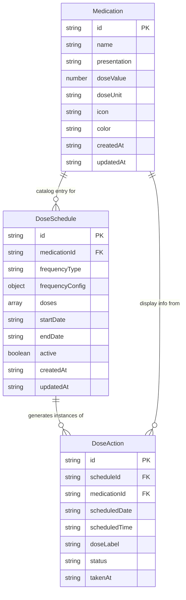

# Medi-alert

Medication reminder PWA with offline support, dose scheduling, and day-by-day tracking.

## Tech Stack

- React 19 + TypeScript
- Vite 6 + Tailwind CSS 4
- Zustand (state management)
- idb (IndexedDB wrapper)
- Lucide React (icons)
- PWA + Service Worker (offline)

## Database Structure

3 object stores in IndexedDB:



### Stores

| Store | Purpose |
|-------|---------|
| `medications` | Medication catalog (name, presentation, dose, icon, color) |
| `dose_schedules` | Dose plans linking a medication to a frequency + time range |
| `dose_actions` | User interactions with individual doses (taken/skipped/cancelled) |

### Key Design Decisions

- **On-demand dose computation**: Pending doses are computed from `dose_schedules` at query time instead of being pre-generated. Only user interactions are persisted.
- **Deterministic IDs**: `DoseAction.id` = `${scheduleId}|${scheduledDate}|${scheduledTime}|${doseLabel}` — ensures consistent lookup.
- **No redundant dose values**: `doseValue`/`doseUnit` live in `Medication` and `DoseSchedule.doses[]`; `DoseAction` references these rather than duplicating them.

## Architecture

```
src/
├── components/     # Reusable UI (DoseCard, WeekCalendar, FabMenu, etc.)
├── db/             # IndexedDB layer (idb wrapper)
├── pages/          # Route pages (Home, Medications, More, EditMedication)
├── stores/         # Zustand stores (medication, doseSchedule)
├── wizard/         # Multi-step wizards (MedicationWizard, DoseWizard)
├── types/          # TypeScript interfaces
├── utils/          # Helpers (date, id generation)
└── App.tsx         # Router setup
```

## Commands

```bash
npm run dev       # Start dev server (PWA manifest disabled)
npm run build     # Production build
npm run preview   # Preview production build
npx tsc --noEmit  # Type-check
```

## Features

- Medication catalog with icons, colors, and custom doses
- 3-step dose wizard (select med → frequency → duration)
- Week calendar view with daily dose list
- Dose actions: taken, skipped, cancelled
- Dark/light theme
- Notifications and app badges
- Offline-ready (PWA + service worker)
- Full data deletion
