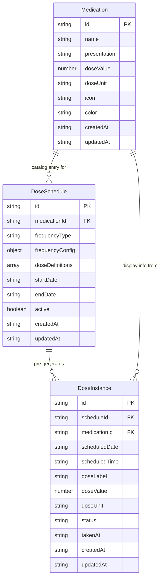

# Medi-alert

Medication reminder PWA with offline support, dose scheduling, and day-by-day tracking.

## Tech Stack

- React 19 + TypeScript
- Vite 6 + Tailwind CSS 4
- Zustand (state management)
- idb (IndexedDB wrapper)
- Lucide React (icons)
- PWA + Service Worker (offline)

## Database Structure

3 object stores in IndexedDB (DB_VERSION 8):



### Stores

| Store | Purpose |
|-------|---------|
| `medications` | Medication catalog (name, presentation, dose, icon, color) |
| `dose_schedules` | Dose plans linking a medication to a frequency + time range (configuration template) |
| `dose_instances` | Pre-generated individual dose occurrences with their current status |

### Key Design Decisions

- **Pre-generated dose instances**: All dose occurrences are generated from `dose_schedules` at creation time and stored as individual `DoseInstance` rows. This enables correct "Solo esta" (single instance) and "Esta y futuras" (future instances matching label+time) deletion semantics with real DELETE operations.
- **Deterministic IDs**: `DoseInstance.id` = `${scheduleId}|${scheduledDate}|${scheduledTime}|${doseLabel}` — ensures consistent lookup.
- **Three deletion modes**: "Solo esta" deletes 1 row, "Esta y futuras" deletes future rows matching schedule+label+time, "Todas" deletes all instances + the schedule. No hidden/occulation tables.
- **Status on the instance**: `status` (`pending|taken|skipped|cancelled|deleted`) and `takenAt` live directly on `DoseInstance` — no separate action tracking table.
- **`DoseDefinition` replaces `Dose`**: Schedules use `doseDefinitions: DoseDefinition[]` (label, time, doseValue, doseUnit) as configuration. Instances carry these values by value at generation time.

## Architecture

```
src/
├── components/     # Reusable UI (DoseCard, WeekCalendar, FabMenu, etc.)
├── db/             # IndexedDB layer (idb wrapper)
├── pages/          # Route pages (Home, Medications, More, EditMedication)
├── stores/         # Zustand stores (medication, doseSchedule)
├── wizard/         # Multi-step wizards (MedicationWizard, DoseWizard)
├── types/          # TypeScript interfaces
├── utils/          # Helpers (date, id generation)
└── App.tsx         # Router setup
```

## Commands

```bash
npm run dev            # Start dev server (PWA manifest disabled)
npm run build          # Production build
npm run preview        # Preview production build
npm run test           # Run all tests
npx tsc --noEmit       # Type-check
npx vitest run         # Run tests in CI mode
```

## Features

- Medication catalog with icons, colors, and custom doses
- 3-step dose wizard (select med → frequency → duration)
- Week calendar view with daily dose list
- Dose actions: taken, skipped, cancelled with three deletion modes (Solo esta, Esta y futuras, Todas)
- Dark/light theme
- Notifications and app badges
- Offline-ready (PWA + service worker)
- Full data deletion
