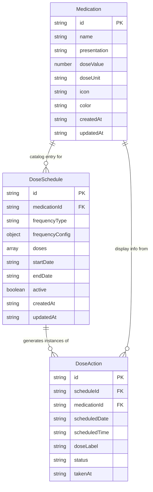

# DB Restructure — On-Demand Dose Computation

## Problem

The current IndexedDB architecture eagerly generates all `dose_logs` for the entire
range of a `DoseSchedule` (startDate → endDate) at creation/update time. This causes:

- **Scale waste**: A 2-year daily schedule with 4 doses/day creates ~2920 records upfront.
- **Sync fragility**: `doseValue`/`doseUnit` duplicated across `Medication`,
  `DoseSchedule.doses[]`, and `DoseLog` — changes to a medication's dose don't
  propagate to existing logs.
- **Workaround complexity**: `deleted_dose_keys` store exists solely to prevent
  regeneration of user-deleted single doses after a schedule edit.
- **Destructive edits**: Editing a schedule deletes and regenerates all dose logs,
  losing history.

## Solution

Replace eager generation with **on-demand computation**. Pending doses are computed
from `DoseSchedule` records at query time. Only actual user interactions
(taken/skipped/cancelled) are persisted.

## Stores

### medications
Unchanged from current model, with one addition:

| Field | Type | Notes |
|-------|------|-------|
| id | string | PK |
| name | string | |
| presentation | Presentation | enum |
| doseValue | number | |
| doseUnit | string | |
| icon | string? | optional icon key |
| color | string? | optional hex color |
| createdAt | string | ISO timestamp |
| updatedAt | string | ISO timestamp — **NEW** |

### dose_schedules
Unchanged from current model, with two changes:

| Field | Type | Notes |
|-------|------|-------|
| id | string | PK |
| medicationId | string | FK → medications |
| frequencyType | FrequencyType | enum |
| frequencyConfig | FrequencyConfig | **without `type` field** |
| doses | Dose[] | array of {label, time, doseValue, doseUnit} |
| startDate | string | YYYY-MM-DD |
| endDate | string | YYYY-MM-DD |
| active | boolean | |
| createdAt | string | ISO timestamp |
| updatedAt | string | ISO timestamp — **NEW** |

**Change**: `FrequencyConfig.type` removed (was redundant with `DoseSchedule.frequencyType`).

### dose_actions (renamed from dose_logs)

Stores only explicit user actions. No `pending` records exist here.

| Field | Type | Notes |
|-------|------|-------|
| id | string | PK — computed deterministically |
| scheduleId | string | FK → dose_schedules |
| medicationId | string | FK → medications (denormalized for query convenience) |
| scheduledDate | string | YYYY-MM-DD |
| scheduledTime | string | HH:mm |
| doseLabel | string | e.g. "Dosis #1" |
| status | DoseStatus | one of `taken` | `skipped` | `cancelled` |
| takenAt | string? | ISO timestamp, set when status = taken |

**Changes from dose_logs**:
- No `doseValue` / `doseUnit` — read from `Medication` at display time.
- No `pending` status stored — pending is inferred by absence of a record.
- `id` is deterministic: `${scheduleId}|${scheduledDate}|${scheduledTime}|${doseLabel}`.

**Indexes**:
- `date` on `scheduledDate`
- `schedule` on `scheduleId`

### deleted_dose_keys
**Removed entirely** — no longer needed since dose regeneration no longer occurs.

## Entity Relationship Diagram



## Simplified Types

```typescript
// FrequencyConfig without redundant type field
interface FrequencyConfig {
  timesPerDay?: number
  days?: number[]
  interval?: number
}

// DoseLog becomes DoseAction — only persisted on interaction
interface DoseAction {
  id: string  // deterministic: `${scheduleId}|${scheduledDate}|${scheduledTime}|${doseLabel}`
  scheduleId: string
  medicationId: string
  scheduledDate: string
  scheduledTime: string
  doseLabel: string
  status: 'taken' | 'skipped' | 'cancelled'
  takenAt?: string
}

// Computed type — represents a dose for a specific day whether pending or acted upon
interface DoseWithDetails {
  id: string
  scheduleId: string
  medicationId: string
  scheduledDate: string
  scheduledTime: string
  doseLabel: string
  status: DoseStatus  // includes 'pending'
  takenAt?: string
  doseValue: number
  doseUnit: string
  medicationName: string
  medicationIcon?: string
  medicationColor?: string
  presentation: Presentation
}
```

## Data Flow

### Loading doses for a date
```
loadDosesForDate(date):
  1. Load all active schedules (startDate <= date <= endDate)
  2. Load all dose_actions for that date
  3. For each schedule, compute which doses fall on that date
     (using frequencyType + frequencyConfig)
  4. For each computed dose, check if a dose_action exists:
     - Yes → use its status
     - No  → status = 'pending'
  5. Enrich with medication info (name, icon, color, doseValue, doseUnit)
  6. Return merged DoseWithDetails[]
```

### Taking / Skipping / Cancelling a dose
```
updateDoseStatus(instanceId, status):
  1. If status = taken/skipped/cancelled → save/update dose_action
  2. If status = pending → no action (implied by absence)
```

### Adding a schedule
```
add(schedule):
  1. Just save schedule
  2. No dose log generation
```

### Editing a schedule
```
update(schedule):
  1. Just update schedule
  2. No log regeneration
  3. Existing dose_actions remain valid (they share the same
     scheduleId + date + time + label pattern)
```

### Deleting a schedule
```
remove(scheduleId):
  1. Delete schedule
  2. Optionally delete associated dose_actions
```

## Migration

DB_VERSION → 5. Migration from v4:

1. Create `dose_actions` object store with indexes on `scheduledDate` and `scheduleId`.
2. Migrate existing `dose_logs` where `status !== 'pending'` to `dose_actions` (remove `doseValue`, `doseUnit`). Discard pending logs — they will be recomputed from schedules.
3. Delete `dose_logs` object store.
4. Delete `deleted_dose_keys` object store.
5. Update all existing `medications` to have `updatedAt` set to `createdAt`.
6. Update all existing `dose_schedules` to have `updatedAt` set to `createdAt` and strip `frequencyConfig.type`.

## Impact on App Code

### Changes needed

| File | Change |
|------|--------|
| `src/types/index.ts` | Add `DoseAction`, update `DoseWithDetails`, update `FrequencyConfig` |
| `src/db/index.ts` | Add `dose_actions` store, remove `dose_logs`/`deleted_dose_keys` stores, remove eager gen functions, add `getDoseActionsByDate`, add `saveDoseAction`, add `getActiveSchedulesForDate`, update migration to v5 |
| `src/stores/doseScheduleStore.ts` | Remove eager generation. Replace `loadDoseLogs` with `loadDosesForDate` (loads schedules + actions + merges). Simplify `add`/`update`/`remove`. `updateDoseStatus` saves/updates dose_action directly. Remove `removeDoseLog`. |
| `src/pages/HomePage.tsx` | Use new `loadDosesForDate` + `doses` from store. FAB stays same. |
| `src/components/DoseCard.tsx` | Remove `onDelete` prop (cancelar replaces delete). Remove "Eliminar dosis" from context menu. Keep edit schedule link. |
| `src/pages/MorePage.tsx` | Remove `deleted_dose_keys` from clear logic. |

### What stays the same
- `MedicationWizard`, `DoseWizard`, `MedicationsPage`, `EditMedicationPage`
- `DoseCard` layout/context menu
- `WeekCalendar`, `FabMenu`, `ThemeToggle`, `Layout`
- All styling and UI text

## Verification

1. `npx tsc --noEmit` passes
2. `npx vite build` produces clean output
3. Existing data in IndexedDB migrates correctly from v4 to v5
4. Creating a schedule shows doses for today
5. Marking a dose as taken persists on reload
6. Editing a schedule doesn't lose existing dose actions
7. Deleting all data clears all stores
